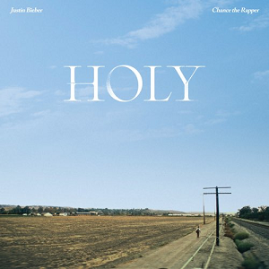

This decade of music has brought about even more genres of music, artists and abilities. With the rise of social media it has meant that people who are new to music and being an artist are able to get their music out to the world and shared on multiple different platforms. 

## Sober - Bazzi

")

Photo credit - <https://bazzi.fandom.com/wiki/Sober>

This ep cover is from a song released by Bazzi in 2017. The cover only features text and a water droplet outline which indicates minimalism and the focus on the words on the cover. With the title of this single being ‘sober’, the use of the white indicates a sense of purity and clean which is highlighting the name of the song as well as making the main focus be on becoming sober and having no distractions.The use of a sans serif font with all capitals makes the words stand out and gives an overall sense of well roundedness and success in what has been achieved.  In order for the song to hold the power it does with the title, there has to be an appropriate representation of what the meaning of the song is all about and the cover art is where the audience will get the most understanding of the type of music and the type of song.  

## Come out and play - Billie Eilish

")

Photo credit - <https://billieeilish.fandom.com/wiki/Come_Out_and_Play>

This ep cover is very different to the previous cover. It is a song that was released by Billie Eilish in 2018 and it was used for an Apple Christmas holiday advert . There is more happening in the cover art and the writing is very different. The use of a handwritten font along with the words “come out and play” indicate a childlike and a sense of innocence. This is further highlighted by the artwork on the cover which connects with the idea of “come out and play”. The use of white as the font colour also creates a sense of purity and a pure heart which also links to this idea of innocence which is relevant to the style of song. 

## Happier - Marshmello and Bastille

Photo credit - [https://en.wikipedia.org/wiki/Happier_(Marshmello_and_Bastille_song)](https://en.wikipedia.org/wiki/Happier_(Marshmello_and_Bastille_song))

This single cover for the song ‘Happier’ by Marshmallow and Bastille from 2019 is a very colourful and bright cover. The use of the big white sans serif font makes it stand out and it seems very wholesome. With the letters all being in caps lock it creates this sense of a loud and happy song which links in with the song title itself. This also helps to indicate the genre of the music and this idea of creating universal happiness. As the font is like a ‘bubble’ font is similar to that used in school therefore highlighting a need for a childlike happiness in people’s lives. 

## Holy - Justin Bieber

Photo credit - [https://en.wikipedia.org/wiki/Holy_(Justin_Bieber_song)](https://en.wikipedia.org/wiki/Holy_(Justin_Bieber_song))

This song cover by Justin Bieber is based on this idea of religion and his personal connection to God and religion and how it has transformed him as a person. The writing used on the song title ‘Holy’ is a serif font which looks very similar to that of the Bible font. The use of the serif font creates an essence of importance and seriousness around this matter and how religion is an important aspect of his life or of anyone who is religious. The use of the white colour evokes this sense of purity and cleanliness which is a key theme in the Bible and also resembles Justin Bieber’s road to cleanliness and purity. The use of all capitals also increases this sense of importance and power that religion holds therefore furthering the meaning of the song.