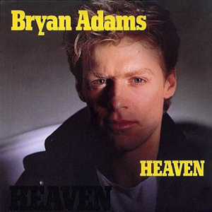

This single album cover of ‘Heaven’ by Bryan Adams is a classic style of cover for an 80’s cover art. The use of a serif font provides a sense of importance about the word and the idea of ‘Heaven’. The use of the yellow in the font evokes happiness and this concept that Heaven is a happy place and something people should look forward to and not dread. The word ‘Heaven’ at the bottom of the cover in the colour black and in all caps is repeating this idea of heaven however as the colour blends in with the background it takes the focus to the yellow font on the page. 

This album cover is ‘Sweet Child O’ Mine’ by Guns N Roses which is a rock band therefore there is a style that is specific to the rock genre. The title of the song is in a serif font and all caps to hint at the rock genre along with the font colour being grey which also hints towards the genre. The rock band’s name is at the centre of the cover to notify the audience who the band is. With them also being very well known it stands out to anyone that see’s it. The font is a serif font and again all caps which is very powerful and helps to make it stand out. As it is engraved in metal it further resembles the genre of the music which specifies its place in the market.

This album by Blondie is called “Call Me” and is a pop song by a female singer therefore it is a stereotypically feminine cover with the pink background. The title of the song “Call Me” is written in a script font which makes it look handwritten, this gives the song a personal touch and as if it is aimed at the audience who is listening to the song. The use of the purple font colour also adds a feminine touch to the cover along with the same colour being used for artist’s name which is below the song title. The artists name is also in script font which stereotypically is very neat indicating that she focuses on presentation and is someone who writes songs for the audience to feel connected to. 

This album cover by Pink Floyd for ‘The Wall’ is a minimalist cover but hints at the genre of music this album is apart of. The font that both the song title and the band name is in is a handwritten font which coloured red to make it stand out against the white background. The font is meant to look like someone has drawn on the wall which makes it look not so put together and scruffy which is the idea behind the album itself and the genre of the music.