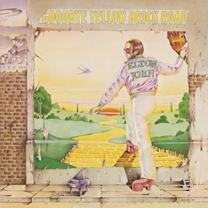
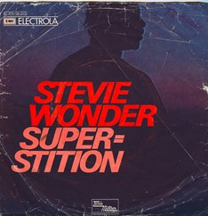
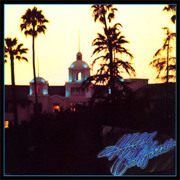

The 70's was a decade of music where there was a lot of exploration around the soft rock genre. Some of the biggest names were creating hits like no other. As this was the decade of vinyl, it meant that these songs were being played in the family home or at big occasions so they were well-known songs and artists. 

## Rumours — Fleetwood Mac

Photo credit - [https://m.media-amazon.com/images/I/71BekDJBb3L._AC\_SL1425\_.jpg](https://m.media-amazon.com/images/I/71BekDJBb3L._AC_SL1425_.jpg)

The typography used on the album cover for Rumours by Fleetwood Mac connects well with the cover image. Fleetwood are a rock band and the typography used represents this genre with it being in all caps. The script typography adds an element of a gothic theme which ties in with the rock genre and also the black and white imagery of the man and the woman. They are also dressed in gothic clothing that further ties in with the genre as well as the font used. The use of the off white background enhances the typography and the images used on the front cover. 

## Goodbye Yellow Brick Road — Elton John

Photo credit - [https://m.media-amazon.com/images/I/81Ls3DlV5YL._AC\_SL1081\_.jpg](https://m.media-amazon.com/images/I/81Ls3DlV5YL._AC_SL1081_.jpg)

The typography used on the album cover of Goodbye Yellow Brick Road by Elton John represents the 70s. The font used is a sans serif font in all caps, which is the same as the writing on the back of Elton John’s jacket. The use of the colour yellow in the font resembles the ‘yellow’ in yellow brick road which is a direct link to the colours of the front cover with the yellow brick road which Elton John is walking on. The style and the colours used, in the cover for both the image and the typography, are reflective of the style of the song and the era of the music. 

## Superstition — Stevie Wonder 

Photo credit - <https://upload.wikimedia.org/wikipedia/en/thumb/b/b1/Stevie_wonder-superstition_single.jpg/220px-Stevie_wonder-superstition_single.jpg>

The typography used on the album cover of Superstition by Stevie Wonder is a representation of 1970’s pop. The use of an italicised sans serif font, for both the song title and the singer’s name, creates a powerful sort of superhero image for the audience. It is a very similar font to that used in superhero movies which links with the word ‘superstition’ used in the title. The background image that accompanies the written text on the cover looks like someone powerful but someone who’s identity cannot be disclosed to anyone. The colour red that is used in the font further supports this idea of a superhero or someone important but also this idea of a possible secret. 

## Hotel California — Eagles

Photo credit - <https://upload.wikimedia.org/wikipedia/en/4/49/Hotelcalifornia.jpg>

The album for Hotel California by the Eagles features a really interesting use of typography for its time. The font used on this album cover is a serif font which looks like a cross between calligraphy and handwritten. The use of the colour blue and purple not only links with the blue highlights in the photo but it also makes the writing stand out from the darker photo on the cover. The writing also resembles that of typical American writing and the bright LED colours that are present in the big cities which stand out in major cities but are also the signifier for the country.