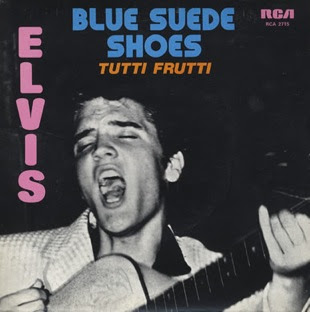
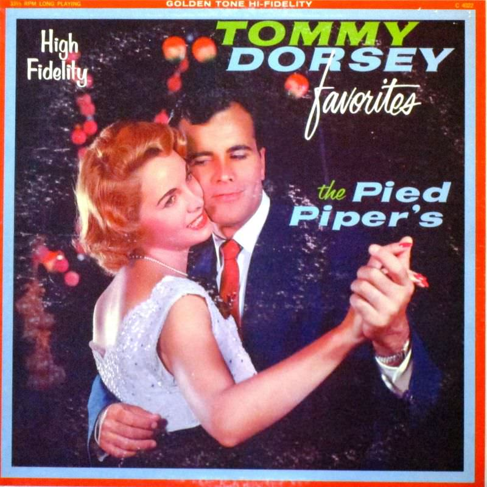
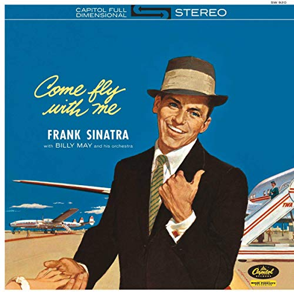
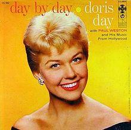

The 50s was a time when really famous people made number 1 hits. People such as Elvis Presley graced the stage with songs that became family songs and known worldwide as well as many other well-known artists that appeared on the stage in the 50s. 

## **Blue Suede Shoes — Elvis Presley**  

The 1950s legend Elvis Presley made loads of songs and albums. This particular song cover is for Blue Suede Shoes and represents what the 50s was like. The use of the sans serif font for both the song title and the artists name is one that was commonly used in the 50s for advertising and other forms of media. The use of all caps also makes the writing stand out against the black background with the collective use of blue for the title and pink for the artist. The blue and pink colours are typical colours for the 50s and they also show the genre of the music and how happy this style of music is along with also visually showing ‘blue suede shoes’ in colours. 

## **The Pied Piper’s — Tommy Dorsey**

This album cover is more stereotypical for the 50s and what young people would visualise he 50s to look like. The font used for the name of the artist as well as the title of the album is the same however, ‘favourites’ and ‘the’ are in a different font. The font for the artist’s name and the title is a sans serif font which is also in bold, this stands out and makes it seem like an important album. However, the font has rounded edges which helps to indicate that this is a family friendly and calm genre of music. Tommy Dorsey’s name is in capitals to show the difference between the name of the artist and the album title itself but also to indicate the importance of this artist. Also the use of primary colours indicates that the expanse of colours was limited which further resembles the time period.

## **Come Fly With Me — Frank Sinatra** 

Frank Sinatra was another 50s legend and known for many songs especially the song ‘Come Fly With Me’. This classic looking cover is what defines what the 50s was like with class and this happy presence of jazz music. The typographic font used on this cover is a serif font that looks like calligraphy which gives an element of sophistication which connotes that Frank Sinatra is a sophisticated man. The 50s was at the height of sophistication and the font reflects this. However, The song title seems like a personal message as if from a letter therefore the font look handwritten to indicate this feeling. The font used for Frank Sinatra’s name a sans serif font that is smaller in size and in all capitals. This is to make his name stand out with the added use of the colour white whilst also keeping the sophisticated theme.

## **Day By Day — Doris Day** 

The 50s famous female singer Doris Day released this album called Day by day. The font used for this album is a serif font, almost like a smart font. To some degree it looks like the font used on the weather in the 50s which links with the song title being ‘day by day’. The use of the colour orange and yellow in the font further highlights this idea of the weather and temperature which is also reinforced by the icon of the sun between the song name and artist.