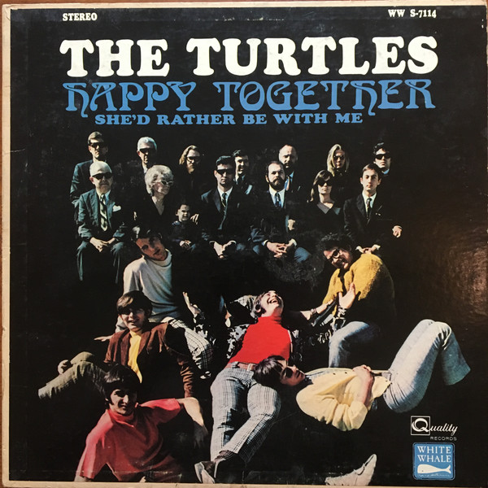
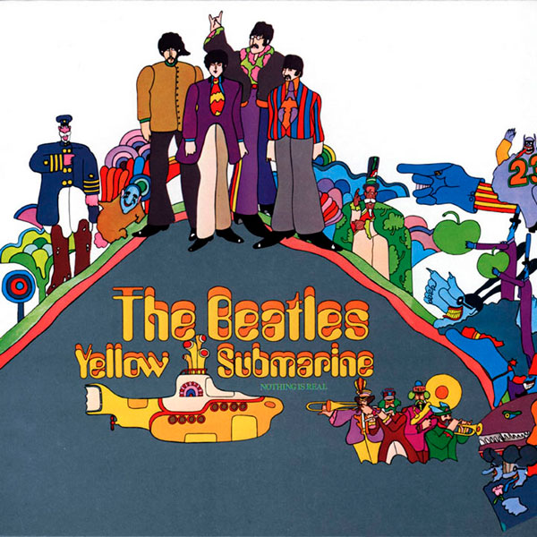
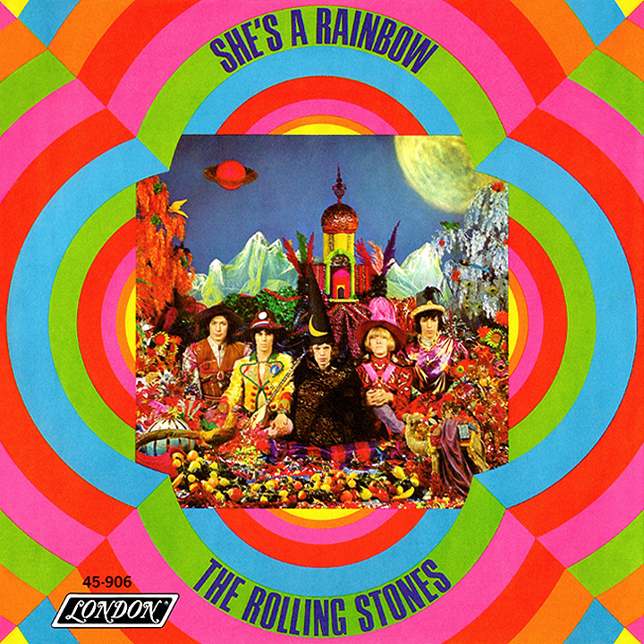

The 60s was a time where psychedelics were common in the culture of 60s society. A lot of the music produced at this time were influenced by psychedelics and the impact they had on the brain. Hippies were common in this time and flower power was a major part, the use of vibrant colours reflects this. 

## **Happy Together — The Turtles** 

The album cover for Happy Together by The Turtles is a song from the 60s and sits in the genre of rock. The title for the song is written in a script font which in some way share a likeness with calligraphy. This font gives a sense of a rock genre as it is very strong looking and is in all capitals which adds to the strong aspect of the title. The use of the colour blue for the song title resembles the 60s era and the bright colours that were very typical of the time. Blue is also a stereotypical masculine colour and The Turtles are a male band therefore reflecting not only the band but also the theme of the song. The font used for the band name is a sans serif font which makes the name stand out whilst also adding to the 60s era. The use of the white colour against the dark background further enhances and highlights the name of the band.

## **Yellow Submarine — The Beatles**  

The album cover for Yellow Submarine by The Beatles is very colour and replicates the 60s time. The font for both the band name and the song name are the same which is a sans serif font however, it is not in all capitals. The yellow colour used for the font is a very bright sunshine yellow which is similar to the colours present in that time. It also shares connotations with the song title as well which is ‘yellow submarine’ therefore further reinforcing the song title. However, there is an orange shadow behind each letter which gives a psychedelic effect which was also common in the 60s and present in various different ways in the culture of the time. The use of this effect with the words helps it to stand out against the darker background. 

## **She’s A Rainbow — The Rolling Stones** 

The album cover for She’s A Rainbow by The Rolling Stones is again another clear representation of the 60’s and the theme that music covers seemed to follow. The font used for this particular cover is a serif font in all capitals with the spacing between each letter very close together. As this genre for this band is rock it means that the font is very bold and sturdy which is relevant to the genre and the type of band that they are. The colour used for this font is a navy blue colour which is darker against the colourful background but not too dark that it draws away from the photo and other colours on the album. The others colours used in the background are very bright and colourful and give a psychedelic effect to reinforce the vibrant and fun culture of the time.  

## **Are you experienced — Jimi Hendrix** 

This vibrant 60s album cover for Jimi Hendrix’s album ‘Are you Experienced’ is a vivd representation of what 60s music looked like and the atmosphere that surrounded it. Jimi Hendrix’s genre of music was hard rock and this cover completely subverts the stereotypical idea for a hard rock album cover. The font used for the band name is the same as the one used in the album name. The use of the sans serif font clearly gets across the hallucinogenic time and the abstract music styles present at the time however, this style of font is not typical of a rock band. The colour also used is very vibrant and stands out against the yellow background as well as being complementary colours. As the name of the album curves around the central circular image, it draws your eyes into the centre as if to replicate a hallucinogenic drug.