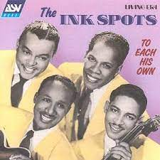
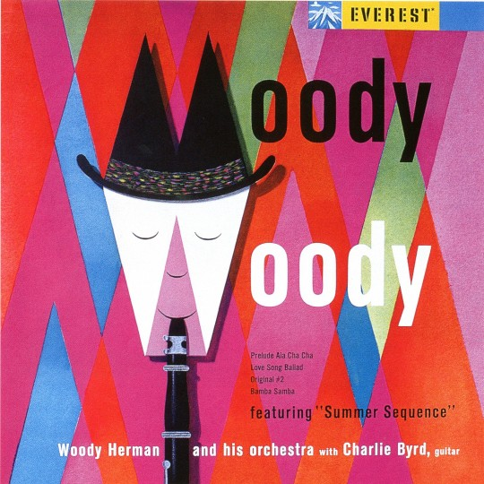
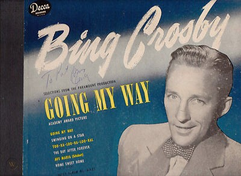

The 40s was a time when music was so important in culture to bring people together, whether that be families, work collegues or general meetings of people. Music was something played at dances therefore it holds such a purpose and that is why jazz music became such a big genre and part of people's lives. 

## **To Each His Own — The Ink Spots** 

The Ink Spots were a well-known jazz band in the 40s, their music was a symbol of the 40s as well as this album cover. The font used for the band’s name is that of a serif font which is in all capitals to make it stand out on the page. It looks similar to the font used for typewriting or at cinemas and theatres which makes it seem like they are broadcasting their best songs. The font used for the title is sans serif which makes it look handwritten a bit like chalk writing, as if it is a personal message to someone or the listener. The colours used are primary colours which is a symbol of how limited the colour choices were for print. 

## **Moody Woody — Woody Herman** 

Woody Herman was a man apart of an orchestra who created this album back in the 1940s. This sort of cover is more colourful than most of the covers that were produced in the 40s and featured more complex content. The font used for the song title is a serif font, however it is not sharp edged which makes it fit the genre of the music being jazz. This effect gives it a softer look without taking away the effect the musician wants of it being seen as important. The use of black and white in the title makes it stand out and is connected to the face on the cover and the ‘W’ is drawn into the face to symbolise difference between each word. The same font is used for the artist’s name however it is smaller in size to not draw the focus away from the song title and the image. 

## **The Letter — Judy Garland** 

The famous Judy Garland wrote a song called ‘The Letter’ and this was a well-known song in the 40s. The font used for this album cover is script which is meant to look handwritten to make it more personal like a letter to someone would be. The use of this font gives connotations of romance along with the white font which is the colour typically associated with marriage and purity like pure love. The artist’s name is in blue which links also to marriage as there is the saying ‘something blue’ which is a direct link to ‘the letter’.

## **Going My Way — Bing Crosby** 

Bing Crosby made an album for Going My Way, one of the most well-known singers of the 40s. The font used for the album cover for the album title is a serif font which is in all capitals which makes it stand out against the blue background and to signify this is the main and important song. The use of the colour yellow is to highlight a happy genre of music being jazz but also to show independence due to the name of the song. The font used for Bing Crosby’s name is a handwritten sans serif font which looks like calligraphy to add a personal touch to the album as if it is signed along with the use of white to stand out against the blue background.